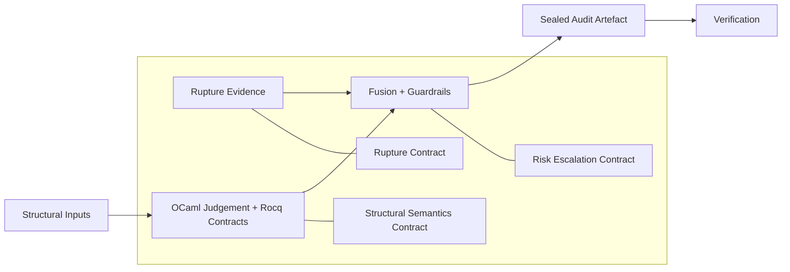

# BEEP Trust Diagram

## Diagram Notes

- **Rupture Evidence**: raw event detections, peak rho, event counts, phase thresholds.
- **Structural Inputs**: Betti numbers and invariant features fed into OCaml judgement.
- **OCaml Judgement + Rocq Contracts**: formal semantics for structural decisions.
- **Fusion + Guardrails**: combines scores, enforces escalation rules.
- **Sealed Audit Artefact**: final payload canonicalised and hashed.
- **Verification**: validates the seal and detects tampering.
